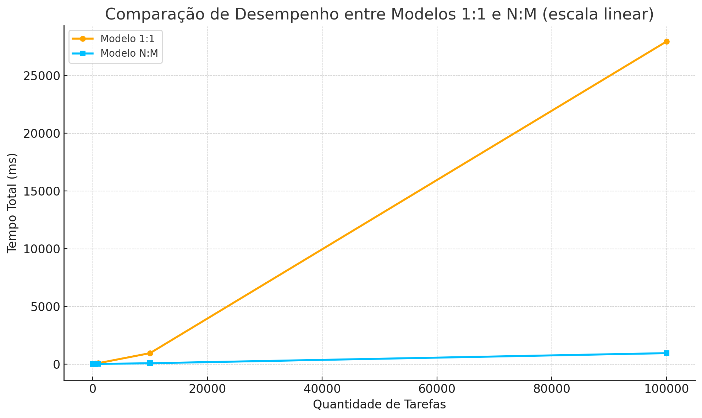

# Atividade Prática: Comparação de Desempenho entre Modelos de Threads N:M e 1:1

## Objetivo:
Desenvolver dois programas em Java que simulem os modelos de execução de threads N:M e 1:1, e comparar o desempenho entre eles com base no tempo total de execução. O objetivo é compreender como o modelo de mapeamento de threads influencia a eficiência da execução concorrente.

## Entregáveis

### Código-fonte dos dois programas (N:M e 1:1)
#### Modelo N:M
```Java
import java.util.ArrayList;
import java.util.List;
import java.util.concurrent.TimeUnit;
import java.util.concurrent.atomic.LongAdder;

public class NtoM {
    static long contador = 0L;
    static class Soma implements Runnable {
        private final int range;

        Soma(int range) {
            this.range = range;
        }

        @Override
        public void run() {
            long acc = 0L;
            for (int i = 0; i < range; i++) acc += i;
            contador += acc;
        }
    }

    static long run(int tasks, int range) throws InterruptedException {
        List<Thread> threads = new ArrayList<>(tasks);
        long t0 = System.nanoTime();
        for (int i = 0; i < tasks; i++) {
            threads.add(Thread.startVirtualThread(new Soma(range)));
        }
        for (Thread t : threads) t.join();
        long t1 = System.nanoTime();

        return TimeUnit.NANOSECONDS.toMillis(t1 - t0);
    }

    public static void main(String[] args) throws Exception {
        int range = 200;
        int[] tasks = {1, 10, 100, 500, 1000};

        System.out.println("range = " + range);
        System.out.printf("%-10s | %-15s%n", "Tasks", "Tempo (ms)");
        System.out.println("-------------------------------");

        for (int t : tasks) {
            long tempo = run(t, range);
            System.out.printf("%-10d | %-15d%n", t, tempo);
        }
        System.out.println();
    }
}
```

#### Modelo 1:1
```Java
import java.util.concurrent.TimeUnit; //converter o tempo em milissegundos

public class umparaum {
    static long contador = 0L; //variavel global pra acumular o resultado total

    // classe que define o que cada thread vai fazer
    // cada thread faz uma soma independente
    static class Soma implements Runnable {
        private final int range; // até onde vai somar

        // construtor que recebe o limite do range
        Soma(int range) {
            this.range = range;
        }

        @Override
        public void run() {
            long acc = 0L; // variavel local pra somar os numeros
            // faz a soma de 0 até range - 1
            for (int i = 0; i < range; i++) acc += i;
            // adiciona o resultado da soma no contador global
            contador += acc;
        }
    }

    // função que cria e executa as threads
    static long run(int tasks, int range) throws InterruptedException {
        Thread[] threads = new Thread[tasks]; // vetor que guarda as threads
        contador = 0L; // zera o contador antes de começar

        long t0 = System.nanoTime(); // marca o tempo inicial
        // cria e inicia todas as threads
        for (int i = 0; i < tasks; i++) {
            threads[i] = new Thread(new Soma(range)); // cria uma nova thread com a tarefa Soma
            threads[i].start(); // inicia a thread
        }

        // espera todas as threads terminarem (join = aguarda finalizar)
        for (Thread t : threads) t.join();

        long t1 = System.nanoTime(); // marca o tempo final depois de todas acabarem
        return TimeUnit.NANOSECONDS.toMillis(t1 - t0); // retorna o tempo total em milissegundos
    }

    public static void main(String[] args) throws Exception {
        int range = 200; // até onde cada thread vai somar
        int[] tasks = {1, 10, 100, 500, 1000}; // quantidades de threads que vai testar

        // mostra o cabeçalho da tabela
        System.out.printf("%-10s | %-12s%n", "Tasks", "Tempo (ms)");
        System.out.println("-------------------------------------------------");

        // executa os testes e mostra os tempos
        for (int t : tasks) {
            long tempo = run(t, range);
            System.out.printf("%-10d | %-12d%n", t, tempo);
        }
    }
}
```
### Tabela com os tempos de execução para diferentes quantidades de threads
## Modelo 1:1
| Tasks  | Tempo (ms) |
|:------:|:----------:|
|   1    |     0      |
|   10   |     1      |
|  100   |     9      |
|  500   |     39     |
|  1000  |     76     |
| 10000  |    942     |
| 100000 |   27932    |

## Modelo N:M
| Tasks  | Tempo (ms) |
|:------:|:----------:|
|   1    |     7      |
|   10   |     0      |
|  100   |     1      |
|  500   |     3      |
|  1000  |     7      |
| 10000  |     68     |
| 100000 |    942     |

### Gráfico comparativo (opcional, mas recomendado)



### Relatório com análise crítica dos resultados
Para poucas tarefas (até ~100), ambos os modelos têm desempenho muito parecido — as diferenças estão dentro da margem de erro natural de medição.

A partir de 500 tarefas, o modelo 1:1 começa a crescer em tempo de forma quase exponencial, pois o sistema precisa criar e gerenciar centenas de threads reais.

O modelo N:M mantém o tempo baixo e estável até 10 000 tarefas, e mesmo com 100 000 ainda é cerca de 30× mais rápido que o 1:1.

Isso mostra que o overhead de criação e troca de contexto (em 1:1) se torna dominante conforme o número de threads aumenta.

O uso do pool fixo no N:M evita essa explosão de threads, distribuindo as tarefas sobre um número limitado de threads reais — aproveitando melhor os núcleos disponíveis.